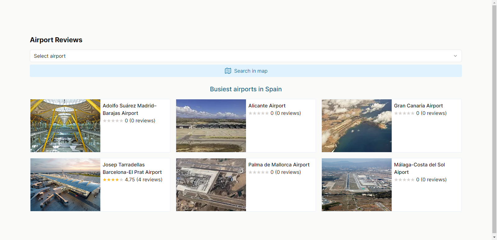
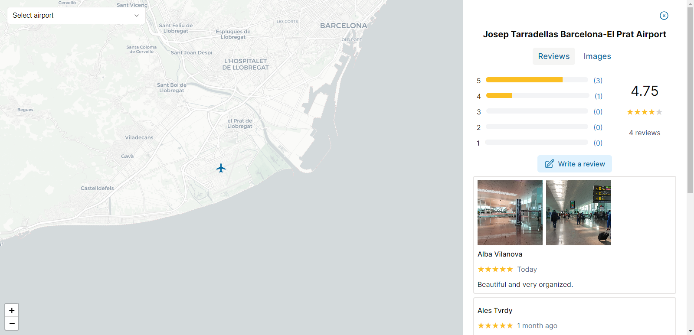

<h1 align="center"><b>Airport Reviews App</b></h1>

This simple front-end app is built using Next.js and can be used to review locations across the world. In this particular case, we are reviewing the principal airports of Spain.



The reviews of each airport can be accessed and written from the map page. Users do not need to register to write their own reviews since all data is saved locally in a JSON file.



You can run it using:

```
bun install
bun run dev
```